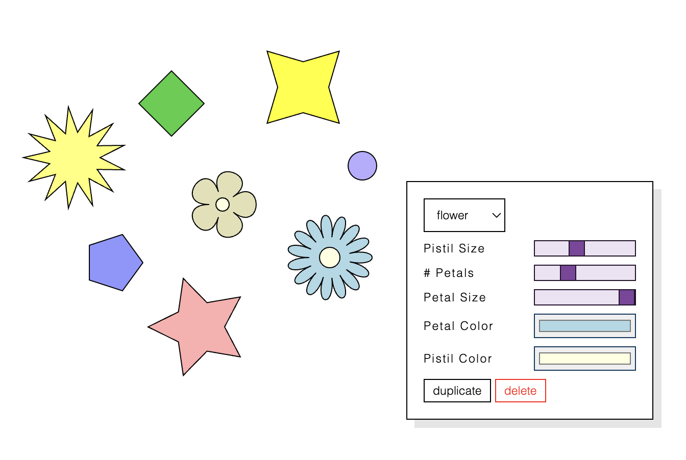

<h1>2D Experiments</h1>

Collection of 2D experiments to help me make plotter art, with the help of p5.js.

 

<h3>#01: Basic Shapes with a custom GUI</h3>

Double-click on a shape to open the shape customization GUI. This example features some basic shape options (polygon, star, and flower) with duplicate and delete functions.

